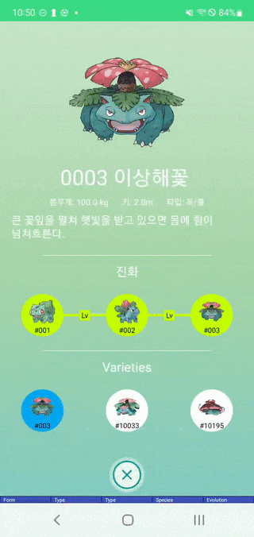

# Cokedex 
* Android Compose 버전 포켓몬 도감 ([Flutter 버전](https://github.com/SunChulBaek/Fokedex))
* Architecture
  * [Compose](https://developer.android.com/jetpack/compose?hl=ko)
  * [ViewModel](https://developer.android.com/topic/libraries/architecture/viewmodel)
  * [Hilt](https://developer.android.com/training/dependency-injection/hilt-android?hl=ko)
  * Single Module
* Libraries
  * [Accompanist](https://github.com/google/accompanist)
  * [Coil](https://coil-kt.github.io/coil/)
  * [core-splashscreen](https://developer.android.com/reference/kotlin/androidx/core/splashscreen/SplashScreen)
  * [Ktor](https://ktor.io/)
  * [Timber](https://github.com/JakeWharton/timber)
* Screenshots
  

      
  

